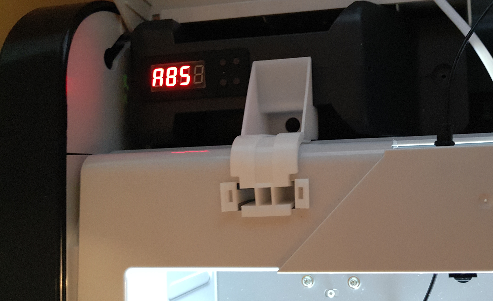
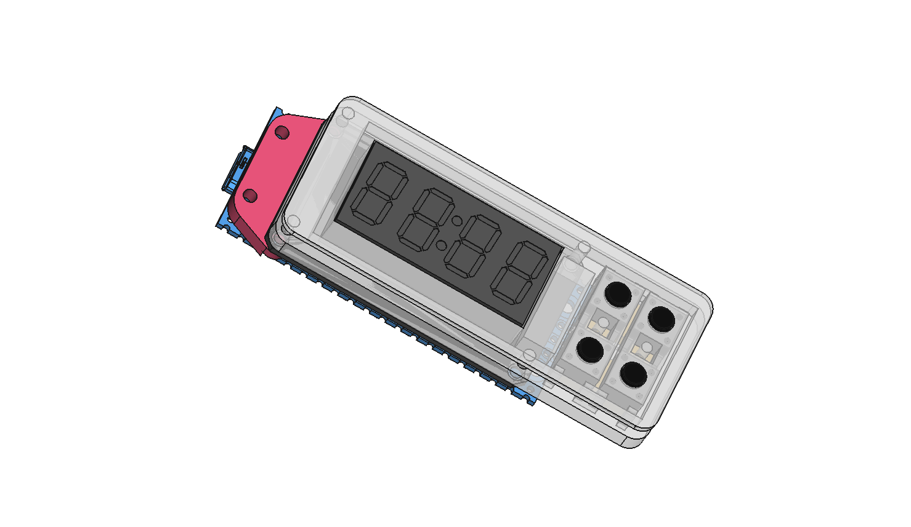
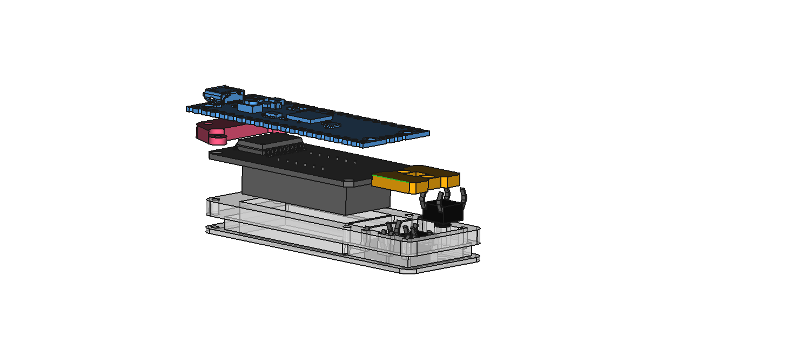
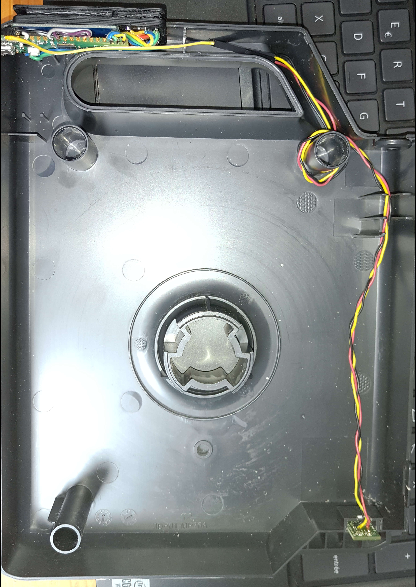
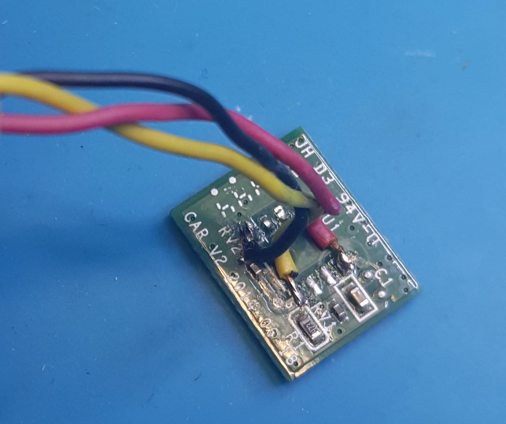
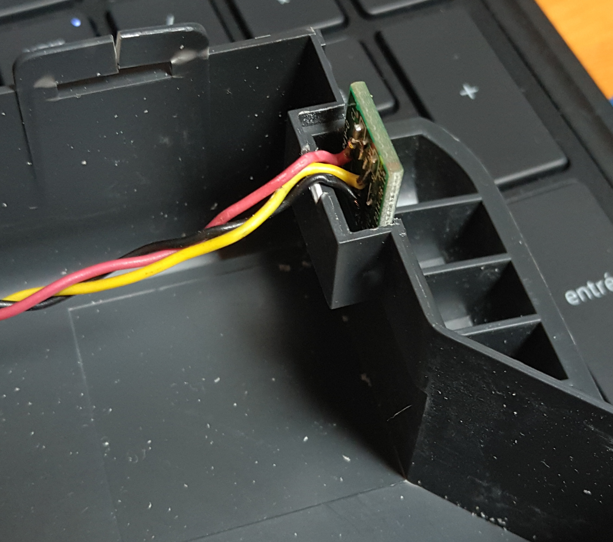
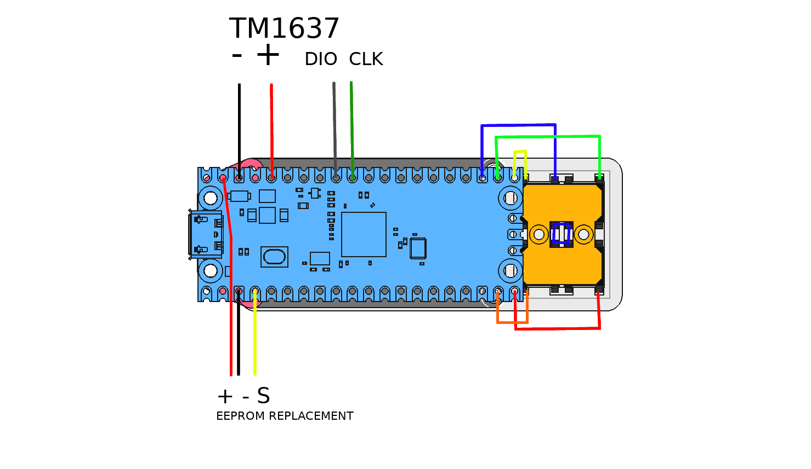
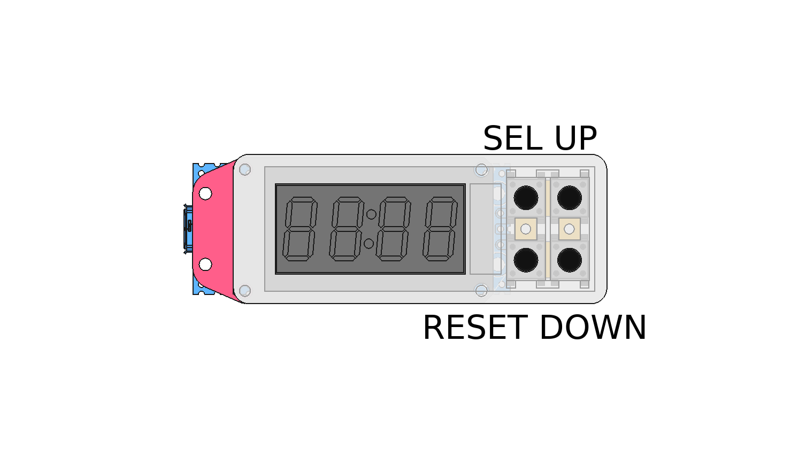

## XYZ Davinci FreeCart

If you are like me bored about having to reset the cratridge chip with an external computer, then this git can maybe help you.

I will take no responsabilities about what you are doing with this or what will hapen with this, if you burn your printer, get injury or everything else, don't blame me, your choice, your responsabilities.
I only share for free my work and by the way I don't want to see this work being reselled on ebay or on other eshop web site.

That said ...

<p align="center" width="100%">
  
  
</p>

## History of the project
I was using for a long time the arduino reseter made by votivo (by the way, thanks to him for he's work), I was stuck on a PLA filament bought on Amazon (Amazon Basics) The filament always clog the nozzle, I had to play a lot with the extruder temperature and all the time had to reprogram the cartridge chip.
To get ride of this, I used a raspberry pico and a 4*7 Digit LED display (TM1637) and using 4 buttons, I made an EEPROM emulator that I put directly inside the original cartridge.

## The Arm choice 

Because I need a fast microcontroller, cheap and 3.3V level for that task, I've choosed the Raspberry Pi Pico.
The raspberry pico is very powerfull, but to achieve my project, I had to overclock it to 291MHz and to use both core to run the code.
On Core 0, the UNIO Slave driver is running, waiting for some command coming from the printer (not using pio because of the UNIO protocol specifications). 
On Core 1, the button and display are handled.

The content of the original EEPROM was dump from a PLA's cartridge chip and is written in the flash memory of the pico. When the program start, the FLASH is loaded into the RAM, every time the printer is writting the lenght update into the cartridge chip, the pico update it's RAM then save it to it's FLASH.

The TM1637 (bought on Amazon) is used to allow the user to changes this settings directly from the cartridge:

<li> Bed Temperature </li>
<li> Extruder Temperature </li>
<li> Filement color </li>
<li> Type of Material </li>
<li> Display and or reset the remaining filament length </li>

When changing bed/extruder temp or color, you can save this settings as a profile for the selected material, there is already a set of profile made in the pico for example :

<li>ABS => Bed : 90*C, Extruder : 210*C, Color : Green </li>
<li>PLA => Bed : 45*C, Extruder : 195*C, Color : Yellow </li>

The available material are :

<li>ABS</li>
<li>PLA</li>
<li>FLEX</li>
<li>PETG</li>
<li>Water Soluble</li>
<li>UVCR</li>
<li>NYLON</li>
<li>ASA</li>

The are 4 buttons used to select the menu, change settings and reset the lenght:

* SEL : Choose menu (Bed, Head, Colo, Mat, Fil)
* UP/DOWN : to increase and decease the values or change items
* RESET : press less than 3sec => Save settings in the FLASH, Press >3s, reset the spool len and change the serial number.

If you have an unknow filament error on the printer, just press 4sec the Reset button, this will change the serial number.
Every changes made uin the menu should be immediatly visible in the cart INFO menu of the printer.
Do not reset or change the settings while the printer is printing as it may fail your printing job.


## Printer firmware

I'm using the original factory shipped firmware on my printer, it is an old one, the version <b>1.1.3</b>, I didn't test this on other version or printer model.


## Installation

First, this suppose that you already follow the raspberry pi procedure and you already have the pico-sdk installed.
Then, git clone this repo and go into the root folder.

Edit the CMakeLists.txt on line 10, change the SDK path with your own SDK Path.

Run the following command to compil the pico code :

```
mkdir build
cd build
cmake ..
make
```

This will end up and create a freecart.uf2 file that you can load via the USB to the pico (in boot mode).

<b> NEVER CONNECT THE USB HOST ON THE PICO WHILE IT IS CONNECTED TO THE PRINTER, the printer is 3.3V level and the main board will be destroyed by the 5V injection coming from the USB over the VSYS line of the PICO. </b> If uyou really want to connect bothj, read carrefully the pico's datasheet, thee are some solution using external schotky diode or mosfet.


## TM1637 Display driver

I used a library made by wahlencraft to drive the TM1637 display, you can find more information here on it's github : https://github.com/wahlencraft/TM1637-pico.git

Thanks for this work, it is included in this repo but I would like to credit wahlencraft for that work.


## Assembly

The step files are in this repo.
I printed them in ABS with a fill density of 50% and a layer height of 0.3 with support material.
You need to cut the cartridge where you want place the control panel, over the EEPROM PCB to make a path for the cables.

<p align="center" width="100%">
  
</p>

<p align="center" width="100%">
  
</p>

<p align="center" width="100%">
  
</p>

You will need to "sacrifice" an original EEPROM from one of your cartridge, you will have to remove the EEPROM from the PCB and to solder 3 wire directly in place of.

<p align="center" width="100%">
  
  
</p>

You have to wire everything like this:

<p align="center" width="100%">
  
</p>


## Button disposition

<p align="center" width="100%">
  
</p>
